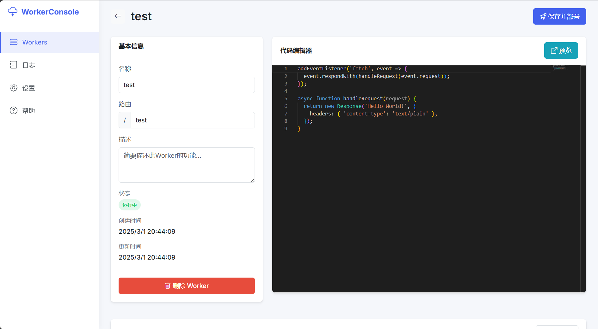

# WorkerConsole

WorkerConsole 是一个本地 Cloudflare Workers 管理系统，允许您在本地创建、管理、编辑、部署和监控 Workers。

## 功能特点

- 创建和管理 Workers
- 在线编辑 Worker 代码
- 实时部署和测试
- 日志监控和查看
- 直观的用户界面

## 界面预览

### Worker 编辑界面


## 系统要求

- Node.js 14.x 或更高版本
- npm 或 yarn

## 安装

1. 克隆仓库：

```bash
git clone https://github.com/yourusername/workerconsole.git
cd workerconsole
```

2. 安装依赖：

```bash
npm install
```

## 使用方法

1. 启动服务器：

```bash
npm start
```

2. 在浏览器中访问：

```
http://localhost:3000
```

## 项目结构

```
workerconsole/
├── public/              # 静态文件
├── src/                 # 源代码
│   ├── config/          # 配置文件
│   ├── controllers/     # 控制器
│   ├── middleware/      # 中间件
│   ├── models/          # 数据模型
│   ├── routes/          # 路由
│   ├── services/        # 服务
│   ├── utils/           # 工具函数
│   ├── index.js         # 入口文件
│   └── server.js        # 服务器配置
├── workers/             # Worker 存储目录
├── package.json         # 项目依赖
└── README.md            # 项目说明
```

## API 文档

### Workers API

- `GET /api/workers` - 获取所有 Workers
- `GET /api/workers/:id` - 获取单个 Worker
- `POST /api/workers` - 创建 Worker
- `PUT /api/workers/:id` - 更新 Worker
- `DELETE /api/workers/:id` - 删除 Worker
- `POST /api/workers/:id/start` - 启动 Worker
- `POST /api/workers/:id/stop` - 停止 Worker
- `GET /api/workers/:id/logs` - 获取 Worker 日志
- `DELETE /api/workers/:id/logs` - 清除 Worker 日志

## 安全注意事项

WorkerConsole 使用 vm2 库在沙箱环境中运行 Worker 代码。虽然 vm2 提供了一定程度的隔离，但它并不是完全安全的。请不要在生产环境中使用此工具，也不要运行不受信任的代码。

## 许可证

MIT 